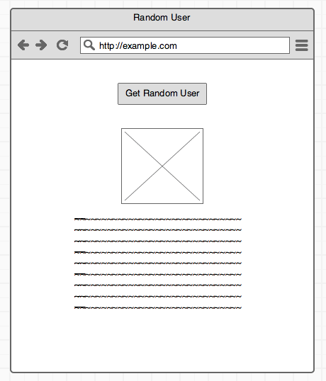

# Random User Challenge

## Requirement

This is your opportunity to show off. Your only requirement:

Create a page where I can click a button and get information on a random user
using the [RandomUser.me](http://randomuser.me) api.

I would roughly expect something like this mock:

## Additional Instructions

Please fork this repo and build the app out of it.

Make it something you'd be proud to show your mamma!

Good luck! You'll do great!
